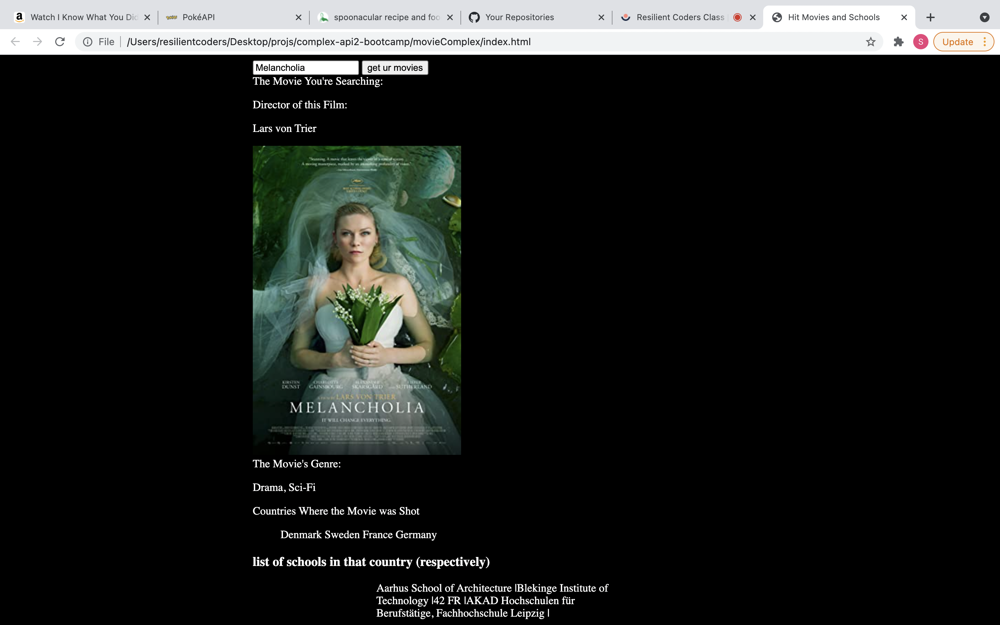

# Movie and School Api

<b>project link coming soon</b>

### How It’s Made

<b>Langs used</b> Javascript, HTML CSS. 

An exercise in making adequate fetch calls. The purpose was to make an app that shows you information on a movie searched, and, based ont he countries that movie was filmed in, it returns a school from that country. An issue that I ran into consistently with this app, and other apps, was the rendering of the properties onto the dom. 

### optimizations
I was working with flexbox to create a way to have them line up in a nice cute column, however that made it unscrollable, as I've come to realize flexbox can do that sometimes. Part of me wants to go back and use grid in order to format it in a way that the audio bar doesn bleed out of the box it's in. 

### Lessons Learned

Honestly, I learned how easy it is to pull other sources of media from an API. The fact that I could pull and audio file and render it into the dom is actually incredible to me, and this makes ideas for future projects a bit easier. Like... let's say I wanted to create a choose your own adventure game that has text that tells a story and then shows you an image or a video or a soudn for theatrical affect. I can literally just create an object interface that's tied to that, and then reference it the main js page, and I can get it to render... or at least that's what my little dev brain is thinking. 