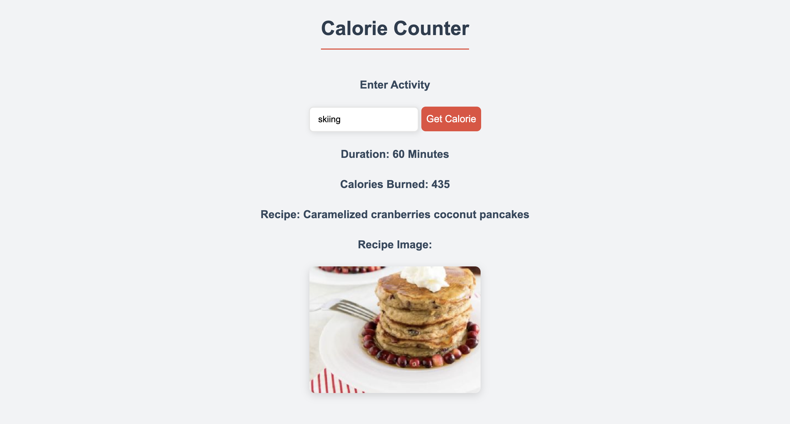

# 📊 Project: Complex Calorie API 

### Goal: Use data returned from one api to make a request to another api and display the data returned

Calorie Searcher API is a fascinating tool that not only finds the calories burned from a specific exercise but also leverages another API to suggest recipes that match those burned calories. This way, users can replenish the exact amount of calories they've just burned. It also displays the recipe's image and title.

## How It's Made:
**Tech used:** HTML, CSS, JavaScript

The primary structure of the application is built using HTML. The styling and responsive designs were implemented using CSS, ensuring a seamless user experience. JavaScript played a pivotal role in this project. With it, we created the user input functionality for exercises and integrated both the calorie search and recipe recommendation APIs. The core logic first fetches the calorie data for a given exercise and then queries the recipe API with that calorie count, rendering the resulting recipe with its image and title on the front end.

## Optimizations
During the development process, we realized that querying both APIs sequentially was causing a slight delay in fetching the recipe results. To enhance the speed, we refactored our code to use asynchronous functions, which led to a significant boost in performance.

## Lessons Learned:
Building the Calorie Searcher API was an enlightening experience. One major realization was understanding the importance of optimizing API calls, especially when relying on multiple external sources. Another significant lesson was seeing how the combination of simple ideas, like calories burned and recipes, can lead to unique and useful tools. The process reinforced the importance of continuous learning, user-centric design, and efficient coding practices.

