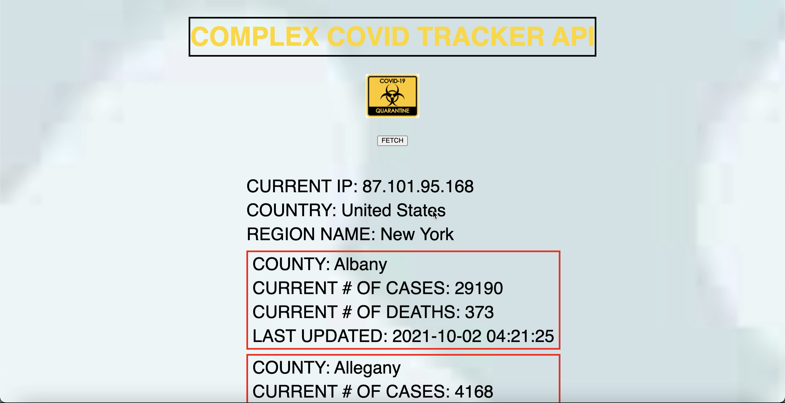

# 🎰 Week08 Bootcamp2021 Project: Complex API 2

### Goal: Use data returned from one api to make a request to another api and display the data returned

This is my Complex Covid API project! Users can fetch the current number of confirmed cases and deaths within their region based on their IP address.

</img>

Link to live site: [https://danielmtran-complexcovidapi.netlify.app]

### How It's Made:

Tech used: HTML, CSS, JAVASCRIPT

I made the basic styling and layout of the app via HTML and CSS. The main functionality of the app was made using Javascript.

### Optimizations:

### Lessons Learned:

I was able to put my newfound skills into making an app that can help others!