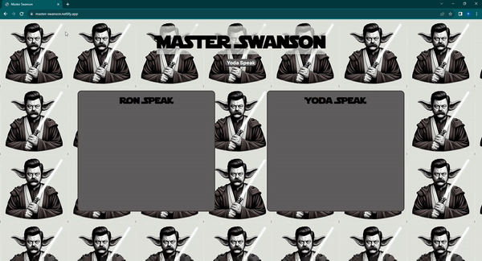

# Master Swanson

A web application that returns random Ron Swanson quotes and translates them to Yoda speak.

Link to project: https://master-swanson.netlify.app/

## How It's Made:

Tech used: HTML, CSS, JavaScript

I used HTML to create the frame of the website. I used CSS to style the sections where the information of the API data will show on the DOM. Then I used JavaScript to create an event listener on the button so that when the user clicks it, it runs the function yodaSpeak. This function uses fetch with the Ron Swanson quote API. From the Ron Swanson API data, I pulled a random quote. Then I nested a second fetch to pull from FunTranslations Yoda Translation API. I used the quote data from the Ron Swanson API as a query parameter for the Yoda Translation API. The Yoda API then translates the Ron Swanson quote to yoda speak and send the translated data to the DOM.  

## Lessons Learned:

With this project, I learned how to properly nest a fetch inside of a fetch and pull data from the first fetch.