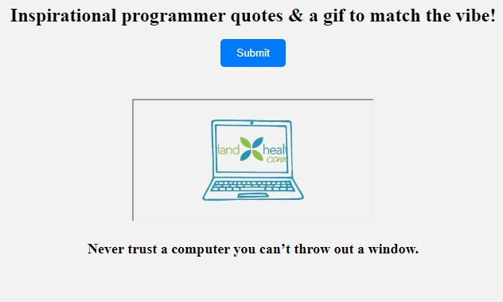

# 📊 Project: Complex API 2

### Goal: Use data returned from one api to make a request to another api and display the data returned

This project is a quote api that presents a quote to the dom randomly on the button click & communicates with the second api to display a gif based on the feeling of the quote.

### How it's Made
Tech used: HTML, CSS, Javascript

I took inspiration from the a japanese style casino & made it food themed.

### Lessons Learned
This was a interesting project to tackle as i had to target certain key words in the quote to find the best matching gif with accuracy.

## Example

