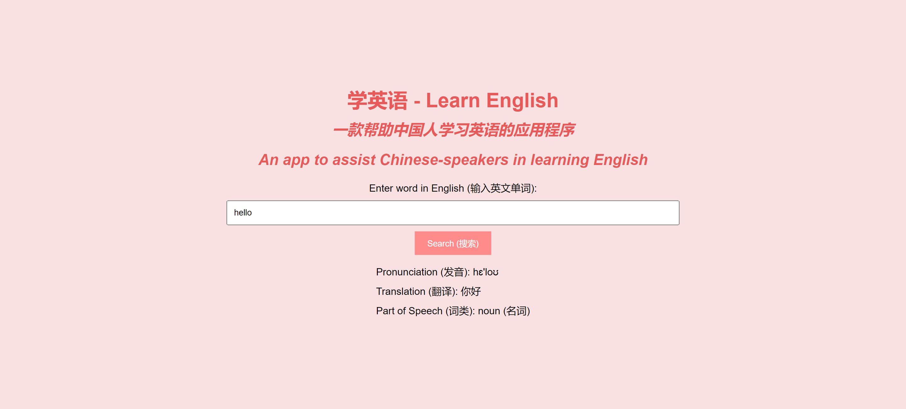

# English Learning App 📚🌐

### Description
Welcome to the "学英语 - Learn English" app! This web application is designed to assist Chinese speakers in learning English. Simply enter an English word, click on the search button, and obtain the pronunciation, Chinese translation, and part of speech of the word. The part of speech is presented in both English and Chinese.

The app integrates data from two APIs:
1. <a href="https://www.wordsapi.com/">WordsAPI</a>: Provides pronunciation and part of speech.
2. <a href="https://cloud.google.com/translate">Google Translation API</a>: Uses the part of speech from API #1 to fetch the Chinese part of speech, alongside the Chinese translation of the word.

Check out the app <a href="https://xsarahyu.github.io/complex-api2-bootcamp/">here</a>!

### Tech Used
- HTML
- CSS
- JavaScript

### Lessons Learned
- <strong>API Integration</strong>: Using data returned from one API to make a request to another.
- <strong>Dynamic UI Updates</strong>: Ensuring a seamless user experience by erasing previous search results before displaying new ones.

Happy learning! 🤓