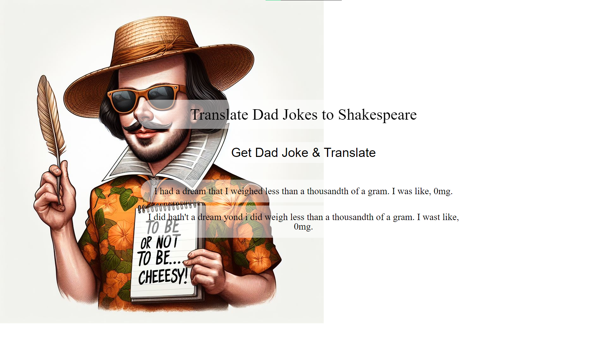

# Dad Joke Translator 🤣📜

## Project Description

The Dad Joke Translator project aims to bring humor with a twist by fetching a dad joke from one API and translating it into Shakespearean language using another API. By clicking the "Get a Dad Joke & Translate" button, users can enjoy a dad joke transformed into the eloquent talk of Shakespeare. The background image was generated by Bing's DALL-E-3 AI image generator.

## How It's Made 🛠️

- **Technologies Used:** HTML, CSS, JavaScript, Fetch API
- **Project Organization:**
  - Organized project into folders: css (for styles), js (for JavaScript files), and the root folder containing README and index.html.

## Lessons Learned 🧠

- **Handling API Rate Limits:**
  - Faced challenges with the Shakespeare API's rate limits (5 requests per hour).
  - Implemented measures to ensure the code operates within the API's limitations.
  - Learned the importance of writing as much code as possible before testing API calls due to rate limits.

- **Chaining API Requests:**
  - Overcame the challenge of passing data from one API to another.
  - Nested the Shakespeare API call inside the fetch for the dad joke API to connect the two.

- **Choosing APIs and Collaboration:**
  - Faced difficulty in selecting suitable APIs for the project.
  - Overcame this challenge through trial and error and sought feedback from collaborators for optimal API combinations.

- **Fetch API and API Headers:**
  - Gained insight into working with the Fetch API, understanding API headers (method and headers).

## Getting Started 🚀

To enjoy a dad joke in Shakespearean language, follow these steps:

1. Clone the repository.
2. Open the `index.html` file in your preferred web browser.
3. Click the "Get a Dad Joke & Translate" button to experience the humor with a Shakespearean twist.

Feel free to contribute, report issues, or provide feedback to enhance the Dad Joke Translator.