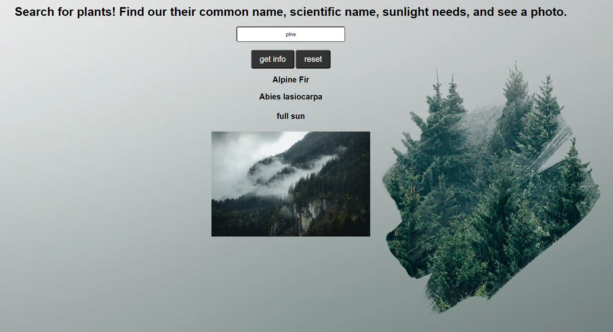

# 🌱 Project: Complex API 2

The plant name data returned from a plant API to was used to make a request to a picture API. Users can see the plants name, how much sunlight it needs, and a photo.

Link to project: https://menahassan-plant-picture-api.netlify.app/

# How It's Made
Tech used: HTML, CSS, JavaScript

# Lessons Learned:
Working on this project allowed me to practice using the fetch method to grab data from an API. The most painful part of this experience was finding APIs that were free and functional. Fortunately, there are some great ones out there if you do a bit of digging.

Once you find a functional API, the rest of the work is fairly straightforward. You just need to map out the path to each data point you're looking to grab. This process looks slightly different for each API you're using since not all data is organized the same way but there's enough of an overlap so that you can generally get a sense of the pattern you need to follow.

